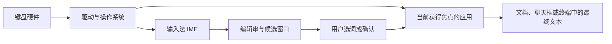

+++
date = '2026-10-05T18:00:00+08:00'
draft = false
title = '电脑输入法是什么：从按键事件到拼音候选与文本上屏'
math = true
+++

安装青简这类拼音输入法后，屏幕上看起来只多了一个候选框：敲下 `kaifa`，再按空格，文本框里便出现“开发”，候选右侧还显示 `development`。但电脑并不是把 `k`、`a`、`i`、`f`、`a` 直接替换成了汉字；它在按键和应用程序之间运行了一套专门的文本输入服务。

这套服务通常被称为**输入法**，英文是 Input Method Editor，简称 **IME**。它解决的核心问题是：键盘按键数量有限，而人类语言的字符、词和表达远多于按键本身。对中文、日文、韩文等文字尤其如此；对英语，拼写纠错、预测补全和释义提示也会使用相似的候选机制。

本文从“按下一个键到文字出现在文档中”这条路径出发，解释电脑输入法的职责、拼音输入的候选是如何产生的，以及青简在候选旁显示英文译词时，额外做了什么。

## 一、先给出结论：输入法不是一个普通的键盘映射表

英文键盘布局的工作可以很简单：按下某个物理键，操作系统根据当前布局把它解释为 `a`、`A`、`1` 或 `!`，应用程序收到的就是最终字符。

拼音输入法不能这样处理。因为 `shi` 可能是“是、时、事、十、使、试、式、识……”；即使每个音节都已确定，`shuru fa` 也可能组合为“输入法”“输入发”等不同词语。按键序列并没有唯一答案。

因此，输入法不是简单的“键 → 字符”表，而是一个在应用和系统之间工作的**交互式解码器**：

```text
键盘按键
  ↓
操作系统产生按键事件
  ↓
输入法保留尚未确定的按键序列（编辑串）
  ↓
词典、拼音规则、语言模型生成并排序候选
  ↓
用户选择候选，或继续输入以消除歧义
  ↓
输入法将最终文本提交给当前应用
```

这里最重要的区别是：**候选阶段的内容尚未真正写进文档；只有“提交”之后，应用才得到最终文本。**

## 二、输入法在系统里的位置

键盘本身只报告“哪个键在什么时候被按下或松开”。它不知道“`a` 是英文字母”，更不知道“`shu ru fa` 应当变成输入法”。从硬件到屏幕上的文字，中间至少经过几个层次。



这幅图容易让人误解为输入法会绕开应用直接“写内存”。实际情况要克制得多：应用告诉系统“这里有一个可输入文本的位置”，系统输入框架再允许输入法维护组合状态，并在合适时把已确认的文本交给应用。输入法通常不能任意修改别的窗口内容。

不同系统的接口名称不同，但分工相似：

| 系统 | 常见输入法框架 | 作用 |
| --- | --- | --- |
| Windows | TSF（Text Services Framework）等文本服务接口 | 让输入法与编辑控件协作处理组合文本和提交文本。 |
| macOS | InputMethodKit 与系统文本输入接口 | 将输入源、候选窗口和应用编辑区域连接起来。 |
| Linux 桌面 | IBus、Fcitx5 等输入法框架 | 在桌面环境、应用与具体输入引擎之间传递输入事件。 |

所以，小狼毫、Rime、青简、微软拼音等“输入法产品”，既可能包含汉字转换引擎，也必须实现或接入相应系统的前端接口。前者决定候选质量，后者决定它能否在浏览器、IDE、Office 和聊天软件里正常工作。

## 三、按键、编辑串与提交文本：三个状态不要混为一谈

以在一个文本框中输入 `shuru fa` 并选中“输入法”为例，表面上只有一次输入，内部却有三个不同的对象。

| 对象 | 示例 | 谁能看到 | 是否已写进文档 |
| --- | --- | --- |
| 按键事件 | `s`、`h`、`u`、`r`、`u`、空格 | 操作系统与输入法 | 否 |
| 编辑串（preedit / composition） | `shuru fa` | 输入法及应用的编辑区域 | 否 |
| 提交文本（commit text） | `输入法` | 应用、文档、撤销栈 | 是 |

### 1. 按键事件不是字符

键盘驱动首先报告的是物理按键或扫描码。操作系统再结合键盘布局、`Shift`、`Ctrl`、输入法状态等，将它解释为有意义的按键事件。机械键盘、笔记本键盘和屏幕键盘的硬件差异，大多会在这一层被屏蔽。

因此，按键 `A` 不能天然等同于字符 `a`：切换布局后它可能代表其他字母；按住 `Shift`、开启 Caps Lock、使用死键（dead key）或输入法时，结果也会改变。

### 2. 编辑串是“还没决定”的文本

输入拼音时，`shuru fa` 往往以带下划线或高亮的形式显示在光标附近。这不是应用文档中的普通字符串，而是输入法暂时维护的编辑串。它允许用户：

- 继续补充拼音，让输入法利用更长上下文重新判断；
- 按退格键修改拼音，而不是删除文档里已经存在的汉字；
- 用方向键、数字键或空格选择候选；
- 按 `Esc` 取消本次组合，而不影响此前已写入的内容。

程序开发中常说的“组合输入”或 composition，指的就是这个阶段。网页、富文本编辑器和桌面应用若没有正确处理它，常见现象就是拼音刚输入一半便被当作正式文本保存、搜索或发送。

### 3. 提交才会改变应用内容

当你按空格、回车、数字键，或者输入法按规则自动确认候选时，它会发送“提交文本”的请求，例如“把 `输入法` 插入当前光标位置”。此后文本属于应用本身：可以撤销、复制、保存和发送；输入法不再把它当作当前编辑串。

这也解释了为什么切换输入法、失去焦点或点击其他窗口时，未确认的拼音有时会消失或被强制上屏：系统正在结束这段尚未完成的组合会话。

## 四、拼音为什么能变成汉字：候选生成的四步

“拼音转汉字”常被叫作输入法的核心。它不是一条固定替换规则，而是一个在大量可能结果中寻找最合理文本的过程。

### 1. 规范化与切分

输入法先接收字母、分隔符和模式切换键，并把它们解释为拼音序列。这个阶段会处理：

- 全拼、双拼、简拼和模糊音的规则；
- 声调是否输入、`ü` 与 `v` 的表示；
- 连续字母应在哪些位置切成音节；
- 数字、英文、网址、日期和表情是否走其他输入规则。

例如 `xian` 至少有两种分析：它可以是一个音节 `xian`，也可能在特殊上下文中被拆成 `xi` 与 `an`。当输入很长、又没有空格分隔时，输入法不能只看单个音节，而要同时尝试多种切分。

### 2. 从拼音词典召回候选字和词

对每段可能的拼音，输入法查找拼音到汉字、汉字词语的映射。例如 `shi` 会召回大量单字和常用词；`shuru` 可以召回“输入”“数入”等拼音相符的词语。单字表、词典和用户自定义词库共同构成候选来源。

如果只到这一步，候选数量会非常大，且经常不通顺。一个实用输入法不能把所有同音字平铺给用户，否则候选框只会变成另一种形式的字典。

### 3. 使用语言模型组合成句子

接下来输入法会判断哪些字词组合更自然。传统方法常使用词频、词典权重和 n-gram 语言模型：它估计某个字词出现在另一个字词之后的可能性。现代输入法还可能使用统计模型或神经网络模型，直接根据整段拼音和上下文给整句候选评分。

可以把目标抽象为：在所有与拼音 $p$ 相符的文本 $w$ 中，选择得分最高的结果。

$$
\operatorname*{arg\,max}_{w \in \mathcal{C}(p)} \operatorname{score}(w, p, \text{context}, \text{user})
$$

其中：

- $\mathcal{C}(p)$：与当前拼音 $p$ 匹配的候选集合；
- `score`：综合拼音匹配、词频、词与词的搭配、前文上下文和个人习惯得到的分数；
- `user`：用户词频、短语和纠错记录等个性化信息。

这并不意味着输入法理解了人的完整意图。它只是根据已有语言数据和当前上下文，在有限候选中做了一个概率意义上的排序。遇到人名、缩写、领域术语或新词时，第一候选出错是正常边界，不是机器故意和你作对。

### 4. 排序、展示与确认

排序后的前几个结果被放进候选窗口。用户可以选择非第一候选、继续输入、删改，或提交第一候选。这个交互反馈十分重要：它让系统不必假装自己永远正确，也让输入法能学习用户最终选择了什么。

完整过程可概括为：

```text
拼音键序列
  ↓
可能的音节切分
  ↓
拼音词典召回字词
  ↓
语言模型组成并评分整句
  ↓
候选列表
  ↓
用户确认后提交到应用
```

## 五、为什么语言模型能在按键时快速给出候选

看到候选框随着每个字母立刻更新，很容易把输入法想成一个正在“理解整句话”的大型聊天模型。实际上，输入法面对的是一个约束非常强、并且可以增量计算的搜索问题。它需要从少量候选中挑选最合适的结果，而不是从所有中文句子中自由生成一句话。

### 1. 拼音先把搜索范围缩小了

用户输入拼音本身就是很强的约束。`kaifa` 的结果不会是“数据库”，`shurufa` 的常见结果也集中在“输入法”等极少数词语附近。输入法通常将拼音词典组织成前缀树（Trie）或其他索引结构；当用户输入 `s`、`sh`、`shu` 时，它只沿匹配前缀继续查找，不匹配的分支会立即被排除。

```text
s
└─ h
   └─ u
      ├─ shu   → 书、树、数、术……
      └─ shuru → 输入、数入……
```

因此，运行时不是扫描整本词典，更不是遍历所有汉字组合，而是在与当前前缀匹配的小范围内查找。

### 2. 每次按键通常复用上一次的结果

输入 `w`、`wo`、`wom`、`women`、`womenjintian` 时，输入法会保存前面已经完成的切分、候选和分数。到了 `women`，“我们”已经是很强的中间结果；后面再输入 `jin`，系统主要是在这个状态上扩展“我们今天”“我们尽量”等后续候选，而不是回到第一个 `w` 重新分析全部拼音。

```text
已保留的中间状态：我们
    ↓ 继续输入 jin / jintian
扩展后续词并重新评分
    ↓
我们今天 的排名上升
```

这种做法称为**增量计算**。它把一次长输入拆成许多很小的更新步骤，因而候选可以随着按键实时刷新。

### 3. 只保留最有希望的少数路径

连续拼音可能有多种音节切分和字词组合。若穷举所有组合，候选数量很快就会失控；但用户屏幕上通常只需要看前几项。因此输入法常使用动态规划配合束搜索（Beam Search）：每推进一个位置，就给若干路径打分，只保留排名靠前的有限条路径，明显较差的分支直接丢弃。

```text
当前拼音片段
    ↓
产生多个切分和词语组合
    ↓
按拼音匹配、词频和上下文评分
    ↓
保留少量高分路径，继续处理下一个片段
```

这是一种有意识的近似。它不保证列出理论上的全部结果，却能以极低延迟留下最值得展示的候选；而用户仍可继续输入或手动选择其他候选来纠正结果。

### 4. 大部分“知识”已在输入前准备好

词典、拼音映射、词频、搭配统计和模型参数，通常在安装、更新或启动加载时就已构建并压缩完成。用户每敲一个键时，输入法只做索引查询、少量候选扩展和分数比较。

| 阶段 | 主要工作 | 是否在每次按键时执行 |
| --- | --- | --- |
| 离线准备 | 收集词典、统计词频、训练和压缩模型 | 否 |
| 启动加载 | 载入常用词典、索引和模型 | 通常只做一次 |
| 输入过程 | 前缀查找、候选扩展、轻量排序 | 是 |
| 确认候选后 | 更新用户词频或学习记录 | 是，但通常很轻量 |

可以把它类比为数据库索引：整理数据的重活提前完成，查询时只沿索引快速定位。若每次按键都扫描全部词典，候选框自然不会如此干脆。

### 5. 神经模型也必须服从交互延迟

现代输入法可能用本地整句模型改善长句转换、纠错和联想，但它们仍要满足接近实时的交互要求。工程上常见的做法包括：量化和剪枝以缩小模型；缓存重复前缀的结果；先用词典和传统模型快速召回，再用较复杂模型精排少量候选；必要时异步补全而不阻塞当前输入。

所以，即使某款输入法包含神经模型，也不意味着每次按键都运行一次类似聊天机器人的完整推理。它通常只对很少的候选状态做轻量预测，并优先保证用户能立即继续输入。

### 6. 它与大语言模型的任务不同

| 项目 | 拼音输入法的候选模型 | 大语言模型聊天或翻译 |
| --- | --- | --- |
| 输入约束 | 已知拼音、词典和输入规则 | 任意自然语言提示 |
| 输出范围 | 少量匹配的中文候选 | 可生成较长的开放文本 |
| 常见计算 | 索引查找、动态规划、打分和束搜索 | 多层神经网络的自回归生成 |
| 延迟目标 | 每次按键接近实时 | 通常可等待数百毫秒到数秒 |
| 用户纠正方式 | 立刻选词、继续输入或删改 | 通常在生成后编辑或重新提问 |

输入法的速度来自问题被严格限定：拼音把候选空间压缩，索引让查询快速，增量计算避免重复工作，束搜索避免组合爆炸。代价则是它只计算最有希望的少数可能，所以人名、新词、专业缩写或罕见语境仍可能排错第一候选。

## 六、为什么输入法会“越用越懂你”

很多输入法会把用户选择过的候选、主动造出的词和常用短语保存到本地用户词典。之后遇到相同或相近拼音，它们便可能被提到更前面。这种机制通常称为**用户词频学习**或**自学习**。

例如，你经常在工作中输入某个项目名；即使它在通用词典里并不常见，反复选中后，输入法可以逐渐提高它的权重。自定义短语则更直接：用户明确告诉输入法某段编码应对应哪段文本。

不过，“学习”并不总是越多越好。它可能带来三类问题：

- 临时输入的错词被错误学习，污染后续排序；
- 多人共用系统账户时，一个人的习惯影响另一个人；
- 云同步或云联想会把输入内容发送到服务端，隐私边界需要单独确认。

以青简为例，项目说明将拼音转换、词库查询、本地模型、输入习惯学习和输入统计设计为默认本地处理；它的可选云联想默认关闭，开启后才会向用户自行配置的 AI 服务发送当前输入和附近文字。实际使用任何输入法时，都应把“本地词典”“同步服务”和“云端生成/联想”分开看，不能因为界面只有一个候选框，就假定数据路径也只有一条。[青简的项目说明](https://github.com/qingjian-team/qingjian#%E6%95%B0%E6%8D%AE%E4%B8%8E%E9%9A%90%E7%A7%81)

## 七、青简的英文提示到底做了什么

青简的主要输入任务仍然是“拼音 → 中文候选”。它在候选旁多做了一层**译词注释**：当某个中文候选被展示时，输入法从释义数据中查找对应的学习语言词汇，再把结果渲染在候选右侧。

```text
kaifa
  ↓
中文候选：开发
  ↓
译词查询：development
  ↓
候选面板：开发    development
```

这与把整句送到机器翻译服务、再生成英文句子是两件事。

| 能力 | 候选旁译词 | 整句机器翻译 |
| --- | --- | --- |
| 输入单位 | 单字、词或短语候选 | 已确定的一整句或一段文本 |
| 主要目标 | 辅助记忆词汇 | 生成目标语言表达 |
| 对上下文的依赖 | 较低，常是词典式映射 | 很高，需要处理语序、语气、搭配和省略 |
| 对应英文 | 可能是常见释义或词形 | 应当根据上下文重写成完整句子 |

因此，看到“开发 — development”很有帮助，但不能把它理解成一个永远成立的等号。例如“开发人员”常用 `developer`，“开发一个功能”可以是 `develop a feature`，“软件开发”又常是 `software development`。候选旁的译词给出的是学习线索，而不是替代语境判断的翻译承诺。语言若真能靠一对一替换解决，翻译这门事大概早就失业了。

## 八、候选窗口为什么看似简单却容易出问题

候选窗口同时涉及输入法、操作系统、显示缩放、窗口焦点和应用编辑控件。它出现位置不对、无法显示、只在某些程序中失效，未必意味着拼音引擎坏了。

常见原因可以按层次排查：

1. **系统输入服务层**：输入法没有被正确注册、进程未启动，或系统当前切换到别的输入源。
2. **焦点与组合层**：应用没有把真正可编辑的文本控件设为焦点；网页中的自定义编辑器也可能没有完整处理组合事件。
3. **应用兼容层**：终端、远程桌面、游戏、管理员权限窗口或旧软件可能采用了特殊输入路径，无法完整支持系统输入法接口。
4. **显示层**：多显示器、不同 DPI 缩放、全屏模式和窗口坐标计算错误，都会让候选框看起来“飘走”。
5. **数据与网络层**：基础拼音转换通常可离线完成；若开启云联想、在线翻译或同步，网络故障只会影响相应附加能力，不应与本地输入引擎混为一谈。

排查时最好先在系统自带记事本或一个普通文本框测试，再测试浏览器、IDE 和目标应用。若基础文本框可用而某个应用不可用，问题通常出在兼容或焦点层；反过来，若所有应用都无法输入，才应优先检查输入法服务和系统设置。

## 九、输入法与应用程序各自负责什么

把职责划开，许多看似神秘的现象就不再神秘。

| 事情 | 主要负责者 |
| --- | --- |
| 识别按下了哪个物理键 | 键盘硬件、驱动、操作系统 |
| 判断当前是否处于中文模式 | 输入法与系统输入源管理 |
| 把拼音转换为汉字候选 | 输入法引擎、词典、语言模型 |
| 显示候选与英文学习提示 | 输入法前端和候选界面 |
| 决定最终选哪个候选 | 用户；输入法只负责默认排序 |
| 将确认文本插入光标位置 | 系统文本输入框架与应用编辑控件 |
| 保存文档、发送消息、支持撤销 | 应用程序 |

输入法的职责不是替应用“键入字符”这么狭窄，也不是可以随意控制所有应用那么夸张。它负责管理一段可组合、可选择、可确认的文字输入过程；应用负责接纳已经确认的文本并处理后续编辑。

## 十、总结

电脑输入法本质上是一层位于键盘事件和应用文本框之间的系统软件。它把有限的按键序列转换为用户真正想提交的文字，并用候选机制把不确定性保留到最后一刻。

- 键盘首先产生的是按键事件，不是天然确定的字符。
- 拼音输入先形成尚未提交的编辑串，再通过词典、切分规则和语言模型生成候选。
- 候选之所以能实时出现，是因为输入法利用前缀索引、增量状态、候选剪枝和预先准备的数据，只计算少量最有希望的路径。
- 候选排序会参考常用词、上下文和用户习惯，但它始终只是推测；用户确认才是最终决定。
- 选择候选后，输入法才向应用提交正式文本，应用随后负责保存、撤销、发送等工作。
- 青简在“拼音 → 中文候选”的主链路旁增加了“中文候选 → 英文译词”的注释层，适合在日常输入中建立词汇对应；它不等同于逐句机器翻译。

理解这条链路后，再看输入法的候选框、词频学习、英文提示或某个应用中的兼容问题，就不会只剩下“它突然不灵了”这一种解释。输入法确实只是一个小窗口，但窗口后面是一条完整的系统文本输入管线。

进一步理解操作系统如何管理应用与硬件，可以阅读同目录的[操作系统概述](操作系统概述.md)。
