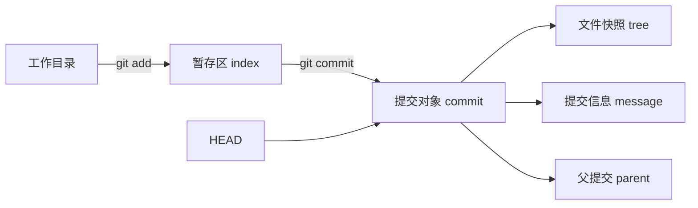
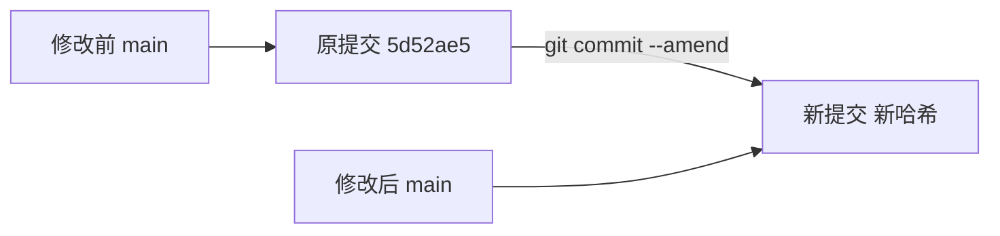
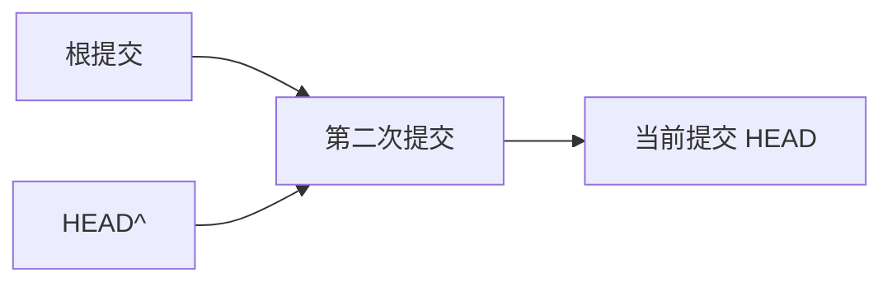

+++
date = '2026-10-05T18:10:00+08:00'
draft = false
title = 'Git 提交对象、git log 与 amend：从首个提交理解多行提交信息'
+++

刚开始使用 Git 时，很容易把 `commit` 想成“某个保存代码说明的文件”。这个理解并不准确：**提交不是工作目录中的普通文件，而是 Git 数据库中的一个不可变对象**。它记录某一刻的项目快照、提交说明、作者、时间，以及与前一提交的关系。

理解这一点后，`git log` 为什么能显示多行说明、`git commit --amend` 为什么会改变提交哈希、根提交为什么不能写 `HEAD^`，都会变得很自然。本文以一个刚初始化的项目为例，说明提交对象、提交信息、多行 `-m`、`--amend` 与安全修改方法。

## 一、提交不是一个可直接编辑的文件

假设刚执行过下面的命令：

```bash
git commit -m "feat(project): 初始化 RAG 智能体项目" \
  -m "建立项目初始基线，并添加本地配置、依赖和构建产物的忽略规则。" \
  -m "Co-Authored-By: Codex <noreply@openai.com>"
```

Git 会创建一个新的**提交对象**。它大致包含以下内容：

| 内容 | 作用 |
| --- | --- |
| `tree` | 指向本次提交对应的完整文件快照 |
| `parent` | 指向父提交；首个提交没有这一项 |
| `author` | 最初编写该提交的身份和时间 |
| `committer` | 实际创建提交的身份和时间 |
| message | 提交标题、正文和尾注 |

整个过程可以这样理解：



其中，`tree` 会继续指向目录和文件内容对象，所以 Git 能恢复某次提交时的完整项目状态。提交信息只是提交对象中的一个字段，并不是仓库根目录下某个叫作 `commit.txt` 的文件。

这些对象通常保存在 `.git/objects/` 中，但会使用 Git 自己的哈希和压缩格式存储。日常开发不应该进入该目录手改内容；这样既不方便，也会破坏 Git 对对象完整性的保证。

## 二、`git log` 展示的内容从哪里来

执行：

```bash
git log
```

常见输出类似：

```text
commit 5d52ae59d5b3cd155246e9c592ddebfc858ac98f (HEAD -> main)
Author: Yukino-insect <2978224828@qq.com>
Date:   Mon Oct 5 17:56:56 2026 +0800

    feat(project): 初始化 RAG 智能体项目

    建立项目初始基线，并添加本地配置、依赖和构建产物的忽略规则。

    Co-Authored-By: Codex <noreply@openai.com>
```

这段输出中：

- 第一行的长字符串是提交 ID，也常称 commit hash；它由提交对象的内容计算而来。
- `Author` 和 `Date` 是该提交保存的作者信息。
- 下方缩进的多行文字是提交对象的 `message` 字段。
- `HEAD -> main` 表示当前 `HEAD` 指向 `main` 分支，而 `main` 指向这个提交。

因此，`git log` 显示的不是某个 Markdown 或文本文件的内容，而是 Git 把提交对象的元数据格式化后展示出来。

如果想直接看当前提交对象，可以使用：

```bash
git cat-file -p HEAD
```

普通提交的结果会接近下面这样：

```text
tree <tree-hash>
parent <parent-hash>
author Yukino-insect <2978224828@qq.com> <timestamp> +0800
committer Yukino-insect <2978224828@qq.com> <timestamp> +0800

feat(project): 初始化 RAG 智能体项目

建立项目初始基线，并添加本地配置、依赖和构建产物的忽略规则。
```

首个提交与普通提交的区别在于：它没有前一个版本，因此没有 `parent` 行。

## 三、为什么一条提交信息可以有多行

提交信息通常分为标题、正文和尾注（trailer）：

```text
<类型>(<范围>): <简短标题>

<正文：背景、决策、验证或风险>

<尾注：关联 Issue、破坏性变更、共同作者等>
```

例如：

```text
feat(project): 初始化 RAG 智能体项目

建立项目初始基线，并添加本地配置、依赖和构建产物的忽略规则。

Co-Authored-By: Codex <noreply@openai.com>
```

这不是三次提交，而是**同一个提交的一条多段消息**。空行用来分隔标题、正文和尾注。这样无论是读 `git log` 的人，还是 GitHub、GitLab 等平台，都更容易识别每一部分的含义。

### 1. 多个 `-m` 参数如何组成多段信息

`-m` 是 `--message` 的缩写，可以重复使用。每增加一个 `-m`，Git 就增加一个消息段落，并在段落之间加入空行。

```bash
git commit \
  -m "feat(auth): 增加邮箱登录接口" \
  -m "统一登录失败响应，并保留原有会话续期逻辑。" \
  -m "Refs #123"
```

结果等价于：

```text
feat(auth): 增加邮箱登录接口

统一登录失败响应，并保留原有会话续期逻辑。

Refs #123
```

一般约定如下：

- 第一个 `-m`：标题，应短、明确，通常不加句号。
- 第二个 `-m`：正文，解释为什么做、做了哪些关键决策。
- 第三个及后续 `-m`：尾注，例如 `Fixes #123`、`BREAKING CHANGE: ...` 或 `Co-Authored-By: ...`。

对于很小的改动，只使用一个 `-m` 也完全正确：

```bash
git commit -m "docs(git): 补充提交信息示例"
```

### 2. 为什么 `git log --oneline` 只显示一行

```bash
git log --oneline
```

通常只显示：

```text
5d52ae5 feat(project): 初始化 RAG 智能体项目
```

`--oneline` 是为了快速浏览历史，只显示短哈希和提交信息的第一行。正文和尾注没有消失，只是被这个输出格式隐藏了。需要查看完整说明时，可以使用：

```bash
git log
git show --no-patch HEAD
git log -1 --format=fuller
```

## 四、`git commit --amend` 实际做了什么

口头上常说“修改最后一次提交”，但更准确的说法是：

> Git 使用当前暂存区和新的提交信息，创建一个新的提交对象，再让当前分支指向新对象。

旧提交不会被原地编辑。提交 ID 是由提交内容计算出来的，只要文件快照、提交说明、时间或元数据发生变化，新的提交就会拥有新的哈希。



执行 `--amend` 后，`main` 会从旧提交移动到新提交。若旧提交尚未推送，通常可以安全地这样整理历史；若已经推送给其他人，则会造成历史改写，需要更谨慎。

### 1. 只修改提交说明：打开编辑器

最后一次提交尚未推送时，执行：

```bash
git commit --amend
```

Git 会打开默认编辑器，并预填当前提交信息。你会看到类似内容：

```text
feat(project): 初始化 RAG 智能体项目

建立项目初始基线，并添加本地配置、依赖和构建产物的忽略规则。

Co-Authored-By: Codex <noreply@openai.com>

# Please enter the commit message for your changes. Lines starting
# with '#' will be ignored, and an empty message aborts the commit.
```

如果只想移除共同作者尾注，删除那一行，保留：

```text
feat(project): 初始化 RAG 智能体项目

建立项目初始基线，并添加本地配置、依赖和构建产物的忽略规则。
```

保存并退出后，Git 会创建新的最后一次提交。代码内容不变，但提交哈希会变化，这是预期行为。

### 2. 不打开编辑器，直接写新的多行信息

已经确定要写什么时，可以用 `-m` 直接完整替换消息：

```bash
git commit --amend \
  -m "feat(project): 初始化 RAG 智能体项目" \
  -m "建立项目初始基线，并添加本地配置、依赖和构建产物的忽略规则。"
```

这会去掉未重新写出的 `Co-Authored-By` 行。

上面是 Bash 的换行写法。在 PowerShell 中，换行连接符是反引号，不是反斜杠：

```powershell
git commit --amend `
  -m "feat(project): 初始化 RAG 智能体项目" `
  -m "建立项目初始基线，并添加本地配置、依赖和构建产物的忽略规则。"
```

命令不长时，也可以写成一行：

```powershell
git commit --amend -m "feat(project): 初始化 RAG 智能体项目" -m "建立项目初始基线，并添加本地配置、依赖和构建产物的忽略规则。"
```

### 3. 编辑器怎样保存退出

`git commit --amend` 打开哪个编辑器，取决于 Git 的 `core.editor` 设置和系统环境。终端看似“卡住”时，通常只是 Git 正在等待编辑器关闭。

| 编辑器 | 保存并退出 |
| --- | --- |
| VS Code | 保存文件，关闭文件标签或窗口；若配置为 `code --wait`，Git 会继续执行 |
| Vim | 按 `Esc`，输入 `:wq`，再按 Enter |
| Nano | 按 `Ctrl+O`、Enter 保存，再按 `Ctrl+X` 退出 |
| 记事本 | 保存文件并关闭记事本窗口 |

若不确定编辑器的操作，使用带 `-m` 的方式通常更直接。不要在编辑器仍打开时关闭 PowerShell；那只会留下一个尚未完成的 Git 进程。

## 五、多条本地提交：从 `--amend` 到交互式 rebase

`git commit --amend` 只处理当前 `HEAD`，也就是最后一次提交。若同一问题出现在多条本地提交中，例如需要从一段尚未推送的历史里移除某个 trailer、统一若干提交标题，或把多条提交重新组织为更清晰的逻辑单元，就需要使用交互式 rebase。

### 1. `git rebase -i --root` 的适用场景

假设一个本地分支从根提交开始有如下历史：

```text
A → B → C → D (HEAD)
```

若需要从 A、B、C、D 的提交说明中都删除同一行尾注，运行：

```bash
git rebase -i --root
```

`--root` 表示从仓库的第一个提交开始处理，因此特别适合初始项目尚未推送、且需要整理整段历史的情况。Git 会打开一个待办列表，形式大致如下：

```text
pick <A> chore(project): 初始化项目
pick <B> feat(core): 添加核心功能
pick <C> docs(project): 补充文档
pick <D> test(core): 添加回归测试
```

常用操作词如下：

| 操作 | 含义 | 常见用途 |
| --- | --- | --- |
| `pick` | 原样保留提交 | 不需要改动该提交 |
| `reword` | 只修改提交说明 | 修改标题、正文或 trailer |
| `edit` | 在该提交暂停 | 修改文件内容、暂存区或提交说明 |
| `squash` | 与前一条提交合并，并编辑合并后的说明 | 合并高度相关的改动 |
| `fixup` | 与前一条提交合并，并丢弃当前说明 | 修正前一提交的小补丁 |
| `drop` | 从新历史中移除该提交 | 删除确认无用的本地提交 |

如果目标只是修改说明，可把相关行从 `pick` 改为 `reword`。Git 会按顺序重放每条提交，并在每次需要修改说明时打开编辑器。

### 2. 为什么改早期提交会连锁改变后续 SHA

提交对象包含 `parent` 字段。假设 A 的 message 被修改：

```text
旧历史：A_old → B_old → C_old → D_old
新历史：A_new → B_new → C_new → D_new
```

即使 B、C、D 的文件快照和提交说明完全不变，它们原本引用的父提交已经从 `A_old` 改为 `A_new`，从 `B_old` 改为 `B_new`，依此类推。`parent` 是提交对象内容的一部分，因此后续提交也必须被重新创建，并获得新的 SHA。

可以将这件事理解为：

```text
修改 A 的说明
→ 创建 A_new
→ 用 A_new 作为 parent 重建 B
→ 用 B_new 作为 parent 重建 C
→ 直到重建 HEAD
```

这也是为什么“只删除一行共同作者尾注”可能导致整段本地历史的 commit ID 全部变化。它不是 Git 额外修改了文件，而是提交对象的父子链必须保持一致。

### 3. 与 `--amend` 的关系

两者的底层原理相同：都不会原地编辑旧提交，而是创建新对象并移动分支引用。

| 需求 | 更合适的命令 |
| --- | --- |
| 修改最后一条本地提交 | `git commit --amend` |
| 修改若干较早提交的说明 | `git rebase -i <base>` |
| 从根提交开始整理本地历史 | `git rebase -i --root` |

因此，`--amend` 可以看作“只重写最后一个提交”的快捷方式；交互式 rebase 则可以重写一段提交链。

### 4. `author` 与 `committer` 在历史重写后的变化

执行 rebase 或 amend 后，通常会出现如下现象：

```text
author    原作者与原始创作时间
committer 重写历史时实际创建新对象的身份与时间
```

这意味着：即使代码内容和 `author` 信息不变，只要重新创建了提交对象，`committer` 时间通常会更新，提交 SHA 也会随之变化。可通过下面命令观察：

```bash
git log --format=raw
```

### 5. 本地历史重写的安全边界

交互式 rebase 适合尚未推送、且由自己独占的本地分支。开始前应检查：

```bash
git status
git log --oneline --decorate --all
git remote -v
```

工作区不干净、提交已被他人拉取、或目标分支已共享时，不应直接重写历史。对于已共享的历史，通常应新增修正提交；若团队明确允许重写个人远端分支，也应使用 `git push --force-with-lease`，而不是裸 `--force`。

## 六、`--amend` 与暂存区的关系

`--amend` 不仅能改说明，也会把**当前已经暂存的改动**写进新的最后一次提交。

### 场景 A：只改提交说明

工作区和暂存区都没有新的改动时：

```bash
git commit --amend
```

通常效果是：文件快照不变，提交说明变化，哈希变化。

### 场景 B：漏提交了一个文件

假设刚提交后发现漏了 `README.md`：

```bash
git add README.md
git commit --amend --no-edit
```

`--no-edit` 的意思是保留原提交说明、不打开编辑器；但暂存区中的 `README.md` 会进入新提交。

### 场景 C：既要补文件，又要改说明

```bash
git add README.md
git commit --amend -m "docs(project): 初始化项目文档" -m "补充 README 与基础使用说明。"
```

这里尤其要小心：`--amend` 会带走暂存区里的**所有**内容。执行前先检查：

```bash
git status
git diff --cached
```

不要为了省一步检查而把无关文件混进最后一次提交。

## 七、为什么首个提交不能写 `HEAD^`

有人想撤销刚提交的版本、但保留暂存区，于是运行：

```bash
git reset --soft HEAD^
```

如果当前提交是仓库的第一个提交，会得到：

```text
fatal: ambiguous argument 'HEAD^': unknown revision or path not in the working tree.
```

原因是：

- `HEAD` 表示当前提交；
- `HEAD^` 表示当前提交的第一个父提交；
- 根提交没有父提交，所以 `HEAD^` 不存在。



当 `HEAD` 本身指向根提交时，它左边没有节点，无法向父提交重置。刚才的命令失败后不会改变仓库状态。

对于尚未推送的根提交，如果确实需要取消分支对它的引用、同时保留工作目录和暂存内容，可以使用：

```bash
git update-ref -d HEAD
```

这不是日常首选命令。它会使分支重新回到“尚无提交”的状态，只应在明确要重新创建初始提交时使用。若真实目的只是改标题或删除一行尾注，`git commit --amend` 更直接也更安全。

## 八、已推送和未推送的边界

是否已经推送，是能否放心使用 `--amend` 的关键。

| 状态 | 是否适合 `git commit --amend` | 原因 |
| --- | --- | --- |
| 仅存在于本地 | 通常适合 | 只会移动自己的本地分支指针。 |
| 已推送但无人基于它开发 | 需先确认 | 后续推送将改写远端历史。 |
| 已推送且他人可能已拉取 | 通常不应修改 | 会让其他人的历史分叉，增加同步成本。 |

对于已推送的共享提交，通常应新建一条修正提交：

```bash
git commit -m "docs(project): 补充初始化说明"
```

若团队明确允许改写个人远端分支，应使用：

```bash
git push --force-with-lease
```

不要使用裸的 `git push --force`。前者会在远端分支已被其他人更新时拒绝覆盖，至少保留一次检查机会。

## 九、修改后怎样验证

每次使用 `--amend` 后，建议运行：

```bash
git status
git log -1 --format=fuller
git show --stat --oneline HEAD
```

分别确认：

- `git status`：工作区和暂存区是否符合预期；
- `git log -1 --format=fuller`：标题、正文、尾注和作者信息是否正确；
- `git show --stat --oneline HEAD`：最后一次提交包含的文件范围是否正确。

如果误操作了本地提交，不要立刻恐慌。先执行：

```bash
git reflog
```

`reflog` 会记录 `HEAD` 和分支指针近期指向过哪些提交；在对象尚未被 Git 清理前，通常能据此恢复。但能恢复不代表可以跳过检查，提交前仍应先看 `git status` 与 `git diff --cached`。

需要注意，历史重写只会让分支引用改指向新提交，并不会立即从对象数据库中物理删除旧提交。旧对象可能暂时仍可通过 reflog 或旧 SHA 找回。对于普通的提交说明整理，这是安全且有价值的恢复机制；但如果历史中包含密码、密钥、令牌或其他敏感信息，不能只依赖 amend/rebase，还应轮换泄露凭据，并根据远端托管平台和团队流程执行专门的敏感信息清理。

## 十、实践清单与总结

面对提交信息和最后一次提交时，可以按下面的规则判断：

- 想查看完整提交说明：用 `git log` 或 `git show --no-patch HEAD`。
- 想快速浏览标题：用 `git log --oneline`。
- 想写标题、正文和尾注：重复使用 `git commit -m "..."`。
- 想改本地最后一次提交的文字：用 `git commit --amend`。
- 想改多条本地提交的文字：用 `git rebase -i <base>`；从首个提交开始整理时用 `git rebase -i --root`。
- 不想打开编辑器：用 `git commit --amend -m "标题" -m "正文"`。
- 漏提交文件：先 `git add <文件>`，再 `git commit --amend --no-edit`。
- 当前是首个提交：不要用 `HEAD^`，因为根提交没有父提交。
- 提交已共享：优先新增提交，不要轻易改写历史。

`commit` 的本质是 Git 数据库中的快照节点，而不是可直接编辑的文本文件。`git log` 显示的是该节点保存的元数据和提交信息；多个 `-m` 会组成同一条消息的标题、正文与尾注；`git commit --amend` 则会创建新的提交对象，替换分支对旧提交的引用。

记住三个原则即可应对大多数日常场景：

- 提交前先检查暂存区，确认文件范围正确；
- 未推送的最后一次提交可以用 `--amend` 整理，已共享的历史优先新增提交；
- 涉及 `HEAD^`、`reset` 或 `update-ref` 时，先确认当前提交有没有父提交，以及自己是否真的想移动分支指针。

Git 并不神秘。它只是严格记录了“文件快照是什么、谁在何时写了什么说明、这个版本接在谁后面”。把提交看成有明确结构的对象，许多看似古怪的命令和报错都可以自行推导。
