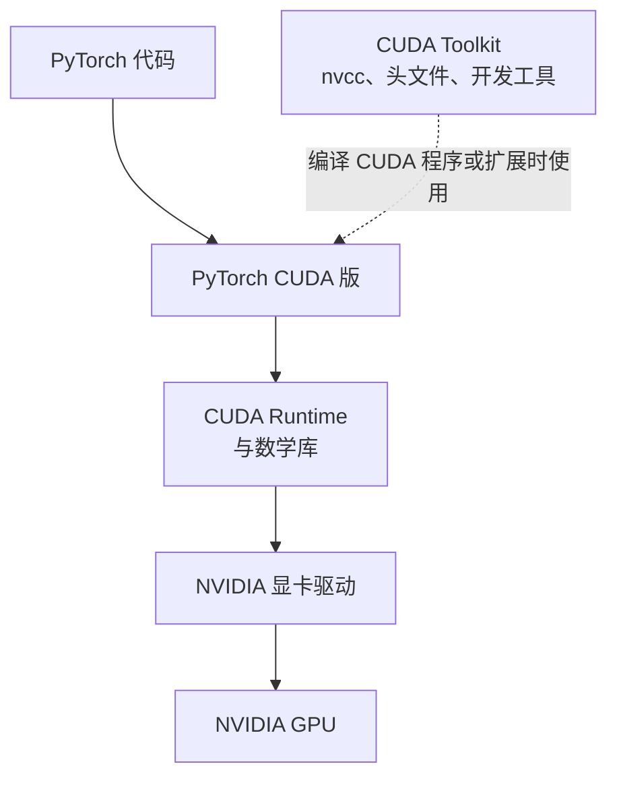

+++
date = '2026-10-05T21:00:00+08:00'
draft = false
title = 'CUDA 与显卡入门：Windows 安装及 PyTorch GPU 实战'
+++

训练深度学习模型、处理大批量矩阵，或运行本地推理服务时，人们常说“让程序用显卡跑”。这句话不算错，却省略了中间最重要的部分：显卡不是天然就能执行 Python 代码；操作系统中的驱动、CUDA 运行时、深度学习框架和模型代码必须正确衔接，GPU 才会真正参与计算。

本文从显卡适合做什么讲起，解释 CUDA、驱动和 CUDA Toolkit 的关系；随后给出 Windows 上两种安装路线，并用一个完整的 PyTorch 示例确认张量、模型和训练步骤都在 CUDA 设备上执行。目标不是背诵安装命令，而是建立一条可排查、可复现的使用链路。

## 一、显卡为什么能加速深度学习

CPU 和 GPU 都能做数值计算，但设计重点不同。

- **CPU（中央处理器）**核心数量相对少、单核能力强，擅长复杂分支、系统调度、串行逻辑和低延迟响应。
- **GPU（图形处理器）**拥有大量更偏向并行计算的执行单元，适合让许多数据执行相同或相近的运算。

以矩阵乘法为例，结果矩阵中的每个元素都要计算一组乘积之和。不同元素之间在大部分时间里可以并行计算；神经网络中的卷积、注意力、线性层和批量张量运算也有类似特征。因此，当数据规模足够大且计算可以并行展开时，GPU 往往能显著缩短训练或推理时间。

不过，“GPU 一定更快”并不成立。把少量数据从内存复制到显存、启动 CUDA 内核、再把结果取回，这些都有开销。对于很小的张量、频繁的 Python 循环、分支很复杂的任务，CPU 反而可能更合适。GPU 的价值来自**规模化并行计算**，不是一种不讲条件的加速魔法。

### 1. 显存与内存：数据必须到正确的地方

CPU 主要访问系统内存（RAM），GPU 主要访问自己的显存（VRAM）。要在 GPU 上计算，模型参数和输入张量都必须位于同一个 CUDA 设备的显存中。

```text
Python 代码
   │
   ├─ CPU 张量、Python 控制逻辑 ──> 系统内存（RAM）
   │
   └─ .to("cuda") ──> GPU 张量、模型参数 ──> 显存（VRAM）
                                           │
                                           └─ CUDA 内核并行计算
```

这也是 PyTorch 报错 `Expected all tensors to be on the same device` 的原因：例如模型在 GPU，而输入还在 CPU，它们无法直接参与同一次矩阵运算。先确认“数据和模型在哪里”，通常比盲目重装环境更有效。

### 2. 哪些显卡能使用 CUDA

CUDA 是 NVIDIA 提供的并行计算平台，因此本文的 CUDA 路线只适用于**受支持的 NVIDIA GPU**。Intel 或 AMD 显卡不能通过安装 CUDA 变成 CUDA 设备；硬件厂商不同，软件栈也不同。

在 Windows 中可以先打开“设备管理器 → 显示适配器”查看型号。更可靠的检查方式是在安装 NVIDIA 驱动后打开 PowerShell，执行：

```powershell
nvidia-smi
```

如果命令能输出 GPU 名称、驱动版本和显存使用情况，说明系统已识别到 NVIDIA GPU 且驱动命令可用。笔记本若同时有核显和独显，应确保程序被分配给 NVIDIA 高性能 GPU；连接在核显上的显示器并不等于 CUDA 不可用，但错误的节能/图形首选项确实会造成误判。

## 二、CUDA、驱动与 Toolkit：不要把三个层次混在一起

“安装 CUDA”在不同语境里可能指不同事情。下面的区分很重要。

| 组件 | 解决的问题 | PyTorch 使用 GPU 是否必需 |
| --- | --- | --- |
| NVIDIA 驱动 | 让 Windows 与 NVIDIA GPU 通信，并提供 CUDA Driver API | **必需** |
| CUDA Runtime | 提供运行 CUDA 程序所需的运行库 | 必需，但常由 PyTorch 包一并提供 |
| CUDA Toolkit | `nvcc` 编译器、头文件、开发库、调试/分析工具与示例 | 通常不必需；编译 CUDA 程序或扩展时需要 |
| PyTorch CUDA 版 | PyTorch 本体及其匹配的 CUDA 用户态依赖 | 使用 PyTorch GPU 时需要 |

它们的关系可以概括为：



### 1. `nvidia-smi` 中的 CUDA Version 不等于 Toolkit 版本

执行 `nvidia-smi` 后，常会看到类似 `CUDA Version: 12.x` 的字段。它表示**当前驱动可兼容的最高 CUDA 版本级别**，不是在电脑上已经安装的 CUDA Toolkit 版本。

判断完整 Toolkit 是否安装、以及 `nvcc` 编译器是否可用，应执行：

```powershell
nvcc -V
```

如果此命令不存在，而 `nvidia-smi` 正常，通常意味着驱动已安装但完整 Toolkit 未安装。这对只运行官方 PyTorch CUDA 包的人来说并不是错误；不要为了消除一个并不影响运行的提示，随意叠装多个 Toolkit。环境越多，版本冲突的机会也越多，显然不是什么值得追求的收藏。

### 2. PyTorch 的 CUDA 版本与本机 Toolkit 是否必须一致

对于通过 `pip` 安装的**官方预编译 PyTorch CUDA 包**，通常不要求本机额外安装同版本 CUDA Toolkit。PyTorch wheel 会带上运行所需的用户态 CUDA 依赖，关键前提是 NVIDIA 驱动足够新。

只有下面这些场景，才应把本机 Toolkit 版本与项目依赖一起认真管理：

- 编译自己的 `.cu` CUDA 程序；
- 用 `torch.utils.cpp_extension` 编译自定义 CUDA 扩展；
- 从源码构建 PyTorch 或其他依赖 CUDA 的原生库；
- 项目文档明确要求某个 Toolkit 版本。

因此，先问自己“我要运行预编译框架，还是要编译 CUDA 代码”。前者以驱动和 PyTorch 安装命令为中心，后者才需要完整开发工具链。

## 三、Windows 安装前的检查与选择

下面的操作以 64 位 Windows 10/11、受支持的 NVIDIA 独立显卡和 Python 3.10 及以上为例。PyTorch 支持范围和可选 CUDA 构建会随版本变化，因此安装前应以 [PyTorch Start Locally](https://pytorch.org/get-started/locally/) 页面中为 Windows、Pip、Python、CUDA 生成的命令为准。

### 1. 安装或更新 NVIDIA 驱动

从 [NVIDIA 驱动下载页](https://www.nvidia.com/Download/index.aspx) 按显卡型号和 Windows 版本下载安装驱动。驱动安装完成后，重新打开 PowerShell 并检查：

```powershell
nvidia-smi
```

正常输出通常包含如下信息，具体数字会因机器而不同：

```text
+-----------------------------------------------------------------------------------------+
| NVIDIA-SMI 5xx.xx              Driver Version: 5xx.xx       CUDA Version: 12.x         |
|-------------------------------+----------------------+----------------------+
| GPU  Name                     | Bus-Id               | Memory-Usage         |
+-------------------------------+----------------------+----------------------+
```

如果提示找不到 `nvidia-smi`，先检查驱动是否安装成功，再重启系统。不要在这一步就开始反复安装 Python 包；没有可工作的驱动，任何 CUDA 版 PyTorch 都无从谈起。

### 2. 选择安装路线

**路线 A：只用 PyTorch 运行或训练模型。** 这是多数学习者和应用开发者的选择。安装 NVIDIA 驱动、创建 Python 虚拟环境，然后安装官方 PyTorch CUDA 包即可；**不需要先安装完整 CUDA Toolkit**。

**路线 B：还要开发/编译 CUDA。** 除路线 A 所需的驱动外，安装完整 CUDA Toolkit；若要在 Windows 上编译 `.cu` 项目或原生扩展，通常还需要安装 Visual Studio 的“使用 C++ 的桌面开发”工作负载和 MSVC 工具链。

两条路线可以共存，但不要把“我只想运行 PyTorch”误操作成“必须手动安装所有 CUDA 开发组件”。这只会增加磁盘占用和版本组合，并不会使张量更快地到达显存。

## 四、路线 A：为 PyTorch 安装 CUDA 运行环境

### 1. 创建独立的 Python 虚拟环境

在准备存放示例的目录中执行：

```powershell
mkdir pytorch-cuda-demo
cd pytorch-cuda-demo
py -m venv .venv
.\.venv\Scripts\Activate.ps1
python -m pip install --upgrade pip
```

如果 PowerShell 因执行策略阻止激活脚本，可仅在当前窗口执行：

```powershell
Set-ExecutionPolicy -Scope Process -ExecutionPolicy Bypass
.\.venv\Scripts\Activate.ps1
```

虚拟环境能把项目的 PyTorch、NumPy 等依赖与全局 Python 隔离。看到命令行前缀出现 `(.venv)` 后，再继续安装；否则包很可能被装到另一个解释器中，之后再用别的 Python 运行，自然会得出“明明安装了却 import 不到”的结论。

### 2. 安装匹配的 PyTorch CUDA 包

打开 [PyTorch Start Locally](https://pytorch.org/get-started/locally/)，依次选择：

- PyTorch Build：`Stable`；
- Your OS：`Windows`；
- Package：`Pip`；
- Language：`Python`；
- Compute Platform：选择页面为你的驱动和项目提供的 CUDA 选项。

复制页面生成的完整命令执行。以页面提供 CUDA 12.8 轮子时，命令形式如下；版本后缀会变化，请不要把它当成永久不变的咒语：

```powershell
python -m pip install torch torchvision torchaudio --index-url https://download.pytorch.org/whl/cu128
```

如果项目使用 `requirements.txt`、Conda 或特定的 PyTorch 版本，优先遵循项目自身的锁定版本。尤其不要在已经能运行的环境中，随手执行另一个来源不明的 `pip install torch`；它可能把 CUDA 版替换成 CPU 版，或者引入与现有扩展不兼容的版本。

### 3. 在解释器中确认 CUDA 可用

创建 `check_cuda.py`：

```python
import torch

print(f"PyTorch: {torch.__version__}")
print(f"PyTorch 编译使用的 CUDA: {torch.version.cuda}")
print(f"CUDA 可用: {torch.cuda.is_available()}")

if torch.cuda.is_available():
    index = torch.cuda.current_device()
    print(f"当前 CUDA 设备: cuda:{index}")
    print(f"显卡名称: {torch.cuda.get_device_name(index)}")
    print(f"CUDA 设备数量: {torch.cuda.device_count()}")
else:
    print("PyTorch 未检测到可用 CUDA；请按后文排查。")
```

执行：

```powershell
python .\check_cuda.py
```

真正关键的结果是 `CUDA 可用: True`。`torch.version.cuda` 表示这份 PyTorch 构建面向的 CUDA 版本；它可能与 `nvcc -V` 不同，也不应被拿来和 `nvidia-smi` 的显示字段做机械的“必须完全相等”比较。

## 五、路线 B：在 Windows 安装完整 CUDA Toolkit

如果你需要 `nvcc`、CUDA Samples、Nsight 工具，或要编译 CUDA 扩展，再执行本节。NVIDIA 的 [Windows CUDA Installation Guide](https://docs.nvidia.com/cuda/cuda-installation-guide-microsoft-windows/) 是版本支持矩阵、安装器和编译要求的权威来源。

### 1. 安装 C++ 构建工具

准备编译 CUDA 程序时，先安装与目标 Toolkit 版本兼容的 Visual Studio / Build Tools，并在安装器中勾选：

- **使用 C++ 的桌面开发**；
- MSVC C++ x64/x86 生成工具；
- Windows SDK。

Toolkit 对 Visual Studio 版本有支持范围；不要只因为机器上存在某个 IDE，就假定其 C++ 编译器能被当前 `nvcc` 使用。请以目标 CUDA Toolkit 的安装指南为准。

### 2. 下载并安装 Toolkit

进入 [CUDA Toolkit 下载页](https://developer.nvidia.com/cuda-downloads)，选择 Windows、x86_64 和与你的系统匹配的安装方式，再运行安装器。一般保留默认安装目录即可。安装过程中会同时出现驱动和 Toolkit 组件的选项；若驱动已较新，可避免用旧安装包覆盖它。

安装结束后，**新开一个** PowerShell 窗口执行：

```powershell
nvcc -V
Get-ChildItem Env:CUDA_PATH
```

典型结果应能看到 `Cuda compilation tools` 的版本，以及类似 `C:\Program Files\NVIDIA GPU Computing Toolkit\CUDA\vXX.X` 的 `CUDA_PATH`。如果 `nvcc` 找不到：

1. 先确认安装器是否完成、`bin\nvcc.exe` 是否确实存在；
2. 关闭并重新打开终端，让新的环境变量生效；
3. 检查 `PATH` 是否含有 Toolkit 的 `bin` 目录；
4. 若系统装过多个 Toolkit，确认 `CUDA_PATH` 和 `PATH` 指向的是预期版本。

不要手工把随机下载的 DLL 复制到系统目录。CUDA 由驱动、Toolkit、Python 环境和项目依赖共同组成，复制 DLL 只能让错误变得更难解释。

### 3. Toolkit 安装成功不代表 PyTorch 一定会用 GPU

`nvcc -V` 只证明编译器工具链可用；它并不证明当前虚拟环境里的 PyTorch 是 CUDA 版。反过来，`torch.cuda.is_available()` 为 `True` 也不要求 `nvcc` 存在。

因此，两项验证分别回答不同的问题：

| 命令/API | 它验证什么 |
| --- | --- |
| `nvidia-smi` | NVIDIA 驱动和 GPU 是否被系统识别 |
| `nvcc -V` | 完整 CUDA Toolkit 编译器是否可用 |
| `torch.cuda.is_available()` | 当前 PyTorch 环境能否实际访问 CUDA |

## 六、PyTorch 使用 CUDA 的完整示例

下面的例子不依赖下载数据集。它会在 CPU 或 CUDA 上生成一批虚拟分类数据，将模型和数据放到同一设备，执行几轮前向计算、反向传播和参数更新。

创建 `train_on_cuda.py`：

```python
import torch
from torch import nn


torch.manual_seed(42)

# 有 CUDA 时选择第一个 NVIDIA GPU；没有时保留 CPU 兜底，脚本仍可运行。
device = torch.device("cuda" if torch.cuda.is_available() else "cpu")
print(f"使用设备: {device}")

if device.type == "cuda":
    print(f"显卡名称: {torch.cuda.get_device_name(device)}")
    print(f"PyTorch CUDA 版本: {torch.version.cuda}")

# 输入、标签与模型必须位于同一设备。
batch_size = 4096
feature_count = 32
class_count = 4

features = torch.randn(batch_size, feature_count, device=device)
labels = torch.randint(class_count, (batch_size,), device=device)

model = nn.Sequential(
    nn.Linear(feature_count, 128),
    nn.ReLU(),
    nn.Linear(128, class_count),
).to(device)

loss_fn = nn.CrossEntropyLoss()
optimizer = torch.optim.AdamW(model.parameters(), lr=1e-3)

for step in range(1, 6):
    logits = model(features)
    loss = loss_fn(logits, labels)

    optimizer.zero_grad()
    loss.backward()
    optimizer.step()

    print(f"step={step}, loss={loss.item():.4f}")

first_parameter = next(model.parameters())
print(f"模型参数所在设备: {first_parameter.device}")
print(f"输入张量所在设备: {features.device}")

if device.type == "cuda":
    allocated_mib = torch.cuda.memory_allocated(device) / 1024**2
    reserved_mib = torch.cuda.memory_reserved(device) / 1024**2
    print(f"已分配显存: {allocated_mib:.1f} MiB")
    print(f"PyTorch 保留显存: {reserved_mib:.1f} MiB")
```

运行：

```powershell
python .\train_on_cuda.py
```

当 CUDA 可用时，输出应包含类似内容：

```text
使用设备: cuda
显卡名称: NVIDIA GeForce ...
PyTorch CUDA 版本: 12.x
step=1, loss=...
...
模型参数所在设备: cuda:0
输入张量所在设备: cuda:0
```

这几个 `cuda:0` 比“任务管理器似乎有波动”更有说服力：它直接证明当前模型参数和输入张量在第 0 块 CUDA GPU 上。也可以在脚本运行时另开一个终端持续观察：

```powershell
nvidia-smi -l 1
```

它会每秒刷新一次进程和显存使用信息。示例很短，GPU 占用可能转瞬即逝；若想观察得更明显，可以适当增大 `batch_size` 或循环次数，但要留意显存容量，不能把“验证环境”演变为“验证显存溢出”。

### 1. `.to(device)` 到底做了什么

示例中的两类 `.to(device)` 缺一不可：

```python
features = torch.randn(4096, 32, device=device)
model = model.to(device)
```

- 第一行直接在目标设备创建输入张量；也可以先在 CPU 创建，再执行 `features = features.to(device)`。
- 第二行把模型中的参数和缓冲区移动到目标设备。

之后 `model(features)` 会在张量所在的设备上执行相应算子。若只移动模型、不移动输入，或只移动输入、不移动模型，通常会得到设备不一致错误。最稳妥的写法是在训练循环中始终将一个 batch 的所有张量显式移动到 `device`：

```python
for features, labels in data_loader:
    features = features.to(device)
    labels = labels.to(device)

    logits = model(features)
    loss = loss_fn(logits, labels)
```

### 2. 计时前需要同步 CUDA

CUDA 操作通常是异步提交的：Python 发出矩阵乘法请求后，CPU 可能先继续向下执行。因此，不能简单把两行 Python 代码之间的时间当作 GPU 计算时间。

```python
import time

torch.cuda.synchronize()
started = time.perf_counter()
result = model(features)
torch.cuda.synchronize()
elapsed = time.perf_counter() - started

print(f"前向计算耗时: {elapsed * 1000:.2f} ms")
```

正式性能测试还应包含预热、多次迭代、固定输入形状和端到端数据加载成本。一次运行的毫秒数既受显卡影响，也受驱动状态、显存分配、频率策略和后台程序影响；不要用它草率地下结论。

## 七、常见问题与排查顺序

### 1. `torch.cuda.is_available()` 返回 `False`

按下面顺序检查，能避免在不相干的层面打转：

1. 运行 `nvidia-smi`，确认驱动和 GPU 正常；
2. 在当前激活的虚拟环境执行 `python -m pip show torch`，确认不是装到了别的 Python；
3. 执行 `python -c "import torch; print(torch.__version__); print(torch.version.cuda)"`；若 `torch.version.cuda` 是 `None`，通常安装的是 CPU 构建；
4. 回到 PyTorch 官方选择器，复制 Windows + Pip + CUDA 对应的命令重新安装；
5. 检查 GPU 和驱动是否满足该 PyTorch CUDA 构建的要求。

不要用 `pip install cuda` 取代 PyTorch 官方安装命令。CUDA Toolkit、CUDA runtime wheel 和 PyTorch 二进制包不是可以随意互换的同一种东西。

### 2. `RuntimeError: CUDA out of memory`

这说明所需显存超过了可用显存，或显存被其他进程占用。优先尝试：

- 减小 `batch_size`；
- 缩小输入图像、序列长度或模型尺寸；
- 用 `nvidia-smi` 查找占用显存的进程；
- 推理时使用 `model.eval()` 与 `torch.inference_mode()`；
- 在确认不再需要中间张量后删除引用，而不是把所有结果长期存进 Python 列表。

`torch.cuda.empty_cache()` 只会释放 PyTorch 缓存管理器中**当前未使用**的显存块，不会释放仍被张量引用的显存，也不能从根本上修复模型本身超出显存容量的问题。

### 3. 设备不一致错误

典型错误类似：

```text
Expected all tensors to be on the same device, but found at least two devices, cuda:0 and cpu
```

检查模型、输入、标签、损失函数用到的额外张量是否都在同一设备。调试时可以直接打印：

```python
print(next(model.parameters()).device)
print(features.device)
print(labels.device)
```

### 4. 安装了 Toolkit，但 `nvcc` 仍找不到

这通常是终端没有重新打开，或 `PATH` 未包含 Toolkit 的 `bin` 目录。先检查安装目录和 `CUDA_PATH`，不要急于修改全局环境变量。对于只运行预编译 PyTorch 的场景，`nvcc` 找不到并不影响 CUDA 推理或训练；它只影响需要编译 CUDA 代码的任务。

### 5. PyTorch 明明在 GPU 上，速度却不理想

首先确认瓶颈是否真的在模型计算。常见原因包括：

- 每一步都从磁盘读取或在 CPU 上做昂贵预处理；
- CPU 到 GPU 的数据复制太频繁、批量太小；
- Python 循环把可向量化的张量运算拆成大量小算子；
- GPU 显存不足，导致批量过小或发生频繁换页；
- 计时没有用 `torch.cuda.synchronize()`，得到的是不可靠数据。

优化之前先测量数据加载、主机到设备传输和模型前向/反向各自耗时。把所有问题都归咎于“CUDA 没装好”，并不会让性能分析变得更诚实。

## 八、总结

在 Windows 上让 PyTorch 使用 NVIDIA GPU，可以按下面这条链路理解和验证：

1. 确认机器有受支持的 NVIDIA GPU，并用 `nvidia-smi` 验证驱动；
2. 只运行 PyTorch 时，优先在虚拟环境中安装官方提供的 CUDA 版 PyTorch，通常不必预装完整 CUDA Toolkit；
3. 需要编译 `.cu` 文件或 CUDA 扩展时，再安装与项目兼容的 CUDA Toolkit 和 C++ 工具链，并用 `nvcc -V` 验证；
4. 在 PyTorch 中用 `torch.cuda.is_available()` 验证当前环境，再把模型和数据一起移动到 `device`；
5. 出现问题时，从驱动、当前 Python 环境、PyTorch 构建、张量设备四个层次依次排查。

最终要记住的并不复杂：`nvidia-smi` 验证驱动，`nvcc -V` 验证开发工具链，`torch.cuda.is_available()` 验证当前 PyTorch 是否真的能访问 GPU。三者各司其职，混为一谈只会让本来可以很清楚的问题变得冗长而混乱。
