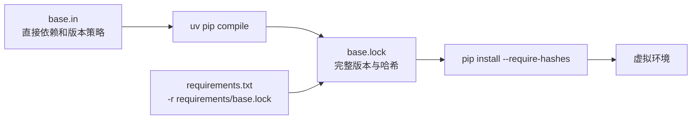
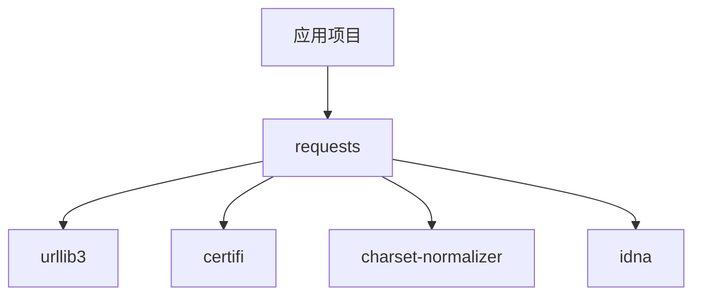

+++
date = '2026-10-05T23:10:00+08:00'
draft = false
title = 'Python 依赖管理与锁文件：从 requirements 到 CPU 和 CUDA Profile'
+++
Python 项目里最容易被低估的一行，往往是：

```text
torch>=2.2
```

它看上去像是在声明“项目需要 PyTorch”，实际上却没有回答几个更重要的问题：到底安装哪个版本、间接依赖怎么选、CPU 与 CUDA 选哪个二进制包、不同开发者能否得到相同环境，以及下载到的文件是否就是团队验证过的文件。

小项目里，这类模糊通常只会带来一点运气成分；图像处理、机器学习、桌面应用或 CI 项目里，它很容易变成“我的机器能跑，你的机器不行”的开端。本文从依赖声明、锁文件、哈希校验讲起，再解释为什么 PyTorch 的 CPU/CUDA 版本必须使用不同 profile，并给出一套可复用的 `requirements.in → lock → 安装脚本` 工作流。

如果你还不熟悉 `pip`、虚拟环境和 `uv` 的基础定位，可以先阅读同一站点的 [uv 和 pip 有什么区别](uv_vs_pip.md)。这里的重点是**可复现的依赖交付**，而不是比较哪个命令打字更快。

## 一、先认识 requirements、`-r`、`.in` 与 lock

在讨论“锁文件”之前，先把几个看上去相似、实际职责不同的名字拆开。否则看到 `requirements.txt`、`requirements.in`、`base.lock` 只会觉得它们是在换着花样增加文件数量；这当然不是重点。

### 1. `requirements.txt` 是常用文件名，不是某种唯一格式

`pip install -r requirements.txt` 中的 `-r` 表示“把这个文件当作 pip requirements file 读取”。这种文件通常叫 `requirements.txt`，但这只是社区约定，不是强制文件名。它可以叫：

```text
requirements.txt
requirements-dev.txt
requirements/base.in
requirements/torch-cu126.lock
```

只要把它传给 `pip install -r <文件>`，pip 就会按 requirements file 的规则解释其中的每一行。该格式可以包含包名、版本约束、URL、本地 wheel、可编辑安装、索引选项，也可以继续引用别的 requirements 或 constraints 文件。[pip 的 requirements 格式文档](https://pip.pypa.io/en/stable/reference/requirements-file-format/)明确说明，`requirements.txt` 只是此类文件最常见的名字，而不是格式本身。

最简单的 requirements file 是一份待安装清单：

```text
# requirements.txt
requests
Pillow>=10,<12
pytest==8.3.5
```

执行：

```bash
python -m pip install -r requirements.txt
```

时，pip 会安装这三个直接需求，并继续解析它们的间接依赖。这里的 `requirements.txt` 可能是“声明文件”，也可能是“锁定后的完整文件”；**必须看内容，不能只看文件名**。

### 2. `-r`：把另一个 requirements file 包含进来

requirements file 内部还可以写 `-r`。它不是安装一个名为 `-r` 的包，而是告诉 pip：继续读取另一份 requirements file。

```text
# requirements.txt
-r requirements/base.lock
```

因此下面两条命令在“读取哪些需求”这个意义上等价：

```bash
python -m pip install -r requirements.txt
python -m pip install -r requirements/base.lock
```

第一种写法的价值在于提供一个稳定入口。团队成员、CI 或部署脚本不必知道锁文件存在哪个子目录；维护者可以在入口文件中组织不同的依赖集合。

例如开发环境常写成：

```text
# requirements-dev.txt
-r requirements/base.lock
pytest==8.3.5
ruff==0.11.0
```

而当前项目的根目录 `requirements.txt` 只包含：

```text
-r requirements/base.lock
```

这表示它是一个**兼容入口**，只安装不含 PyTorch 的基础依赖；CPU/CUDA PyTorch 则由安装脚本按 profile 单独安装。文件的内容很短，不代表它没有作用；它只是把真正的依赖清单委托给了外部文件。

还要注意两个容易忽略的点：

- `-r` 可以嵌套，但不要形成循环引用，也不要把层级拆得像迷宫；
- `-r` 只负责包含文件，**不会自动开启哈希校验**。安装带哈希的 lock 时，仍应使用 `--require-hashes`，或在经过审查的 requirements 配置中显式启用该全局选项。

### 3. `-c`：约束版本，但不把包加入安装清单

`-c` 与 `-r` 很像，却不是同一件事。

```text
# constraints.txt
urllib3<2.3
pydantic==2.11.7
```

```bash
python -m pip install -r requirements.in -c constraints.txt
```

这里 `constraints.txt` 只告诉解析器“如果需要安装 `urllib3` 或 `pydantic`，版本必须满足这些限制”；它**不会因为文件里写了 `pydantic` 就主动安装它**。这是约束文件最重要的语义区别。uv 的 pip 兼容文档也明确将 constraints 描述为“只控制已安装需求版本、不会触发安装”的文件。[uv constraints 说明](https://docs.astral.sh/uv/pip/compile/#adding-constraints)

简要对照如下：

| 写法 | 它做什么 | 会主动安装其中列出的包吗？ |
| --- | --- | --- |
| `-r requirements.txt` | 读取并加入另一份需求 | 会。 |
| `-c constraints.txt` | 为已出现的需求施加版本边界 | 不会。 |
| `--index-url` | 设置本次安装的主包索引 | 不直接声明包。 |
| `--extra-index-url` | 增加额外候选包索引 | 不直接声明包。 |

### 4. `.in` 是团队约定，不是 pip 的魔法后缀

`requirements.in`、`base.in` 中的 `.in` 通常表示 **input**：这是人维护的输入文件，放直接依赖和版本策略，再交给 `uv pip compile`、pip-tools 等解析器生成完整 lock。

`.in` 并不是 pip 专用语法。技术上，只要内容符合 requirements file 格式，下面的命令同样可执行：

```bash
python -m pip install -r requirements/base.in
```

之所以不建议把 `.in` 直接作为生产安装依据，并不是 pip 看不懂它，而是它通常只记录顶层依赖或范围，无法保证每次解析出的间接依赖完全一致。`.in` 的职责是表达维护者的意图；`.lock` 的职责是保存一次经过验证的具体答案。

同理，`.lock` 也不是 pip 要求的神奇后缀。对于 `pip install -r` 而言，它依旧是一份 requirements file；我们用 `.lock` 命名只是为了让读者一眼知道“这个文件由工具生成、包含精确解析结果，不应日常手改”。`uv.lock`、`poetry.lock`、`pylock.toml` 则是各工具自己的结构化锁文件，不能简单假定 `pip -r` 能直接读取。

### 5. 从 `.in` 到 lock，再到环境的完整过程

将这些文件放进同一张图，关系就清楚了：



这里 `requirements.txt` 并不一定参与“生成 lock”的过程；它可以只是对外暴露的兼容入口。真正需要长期维护的是 `.in` 或 `pyproject.toml`，真正需要在 CI 和部署中安装的是 lock。uv 官方文档也将 `requirements.in → uv pip compile → requirements.txt` 作为 requirements 锁定工作流的示例。[uv：锁定 requirements](https://docs.astral.sh/uv/pip/compile/)

## 二、再区分三件事：声明、解析结果与已安装环境

依赖管理中有三类文件或输出经常混在一起。

| 名称 | 它回答的问题 | 典型形式 |
| --- | --- | --- |
| 依赖声明 | 项目直接需要什么、允许什么版本范围？ | `requirements.in`、`pyproject.toml` |
| 锁文件 | 在某个平台和解析时刻，完整依赖图究竟选了什么？ | `requirements.lock`、`uv.lock` |
| 环境快照 | 当前这个 Python 环境里实际装了什么？ | `pip freeze` 输出 |

它们可以相互生成或校验，但不是同一种东西。

### 1. 依赖声明：表达意图，不负责复现全部细节

下面是一份合理的直接依赖声明：

```text
fastapi>=0.115,<1
uvicorn[standard]>=0.30,<1
sqlalchemy>=2.0,<3
```

它表达的是：项目需要这些能力，接受指定范围内的兼容版本。它没有列出 `starlette`、`pydantic`、`anyio` 等间接依赖，也没有规定解析器最终选择哪一个补丁版本。

这种文件适合人工维护。人应该决定“项目依赖什么”，而不是手工抄写数十个间接依赖。后者既乏味又脆弱，通常还会很快过期。

### 2. 锁文件：记录一次确定的解析结果

解析器读取上面的范围后，可能得到：

```text
fastapi==0.115.12
starlette==0.46.2
pydantic==2.11.7
anyio==4.9.0
...
```

这份完整结果就是锁文件的核心价值：开发机、CI 和部署机不必每次都重新猜测“最新但兼容”到底是哪一组版本。锁文件应提交到版本控制中，并由工具生成，而不是日常手改。

### 3. `pip freeze`：观察结果，不一定是项目规范

`pip freeze` 很有用：它能排查环境，也能在紧急场景下记录当前工作环境。

```bash
python -m pip freeze
```

但它会把你环境中所有已安装包一起导出，包括临时调试包、IDE 插件带来的包和与项目无关的工具。因此它不天然等于“项目应当依赖的内容”。更稳妥的流程是维护直接依赖源文件，再由解析器生成 lock；`freeze` 主要用于核对和救援，而不是替代依赖设计。

## 三、为什么仅仅固定直接依赖仍不够

即使把文件写成下面这样：

```text
requests==2.32.3
```

`requests` 仍会依赖 `urllib3`、`certifi`、`charset-normalizer`、`idna` 等包。若它们没有锁定，今天和下个月执行同一条安装命令，解析器仍可能得到不同环境。

依赖图可以这样理解：



版本范围本身并没有错。它适合表达维护者的兼容策略；问题在于，**部署和测试需要的是一个已被验证的具体答案**。因此常见的分工是：

```text
requirements/base.in     人工维护：直接依赖与版本策略
requirements/base.lock   工具生成：完整依赖图、精确版本、哈希
```

这和编译过程很相似：源文件面向人，构建产物面向机器。两者都应保留，但不应互相伪装。

## 四、哈希校验：锁定版本还不够

固定 `package==1.2.3` 可以防止解析到 `1.2.4`，但无法保证下载到的发行文件没有被替换、损坏或来自错误来源。带哈希的 requirements 会进一步约束安装器：包版本和下载文件的 SHA-256 必须匹配。

```text
example-package==1.2.3 \
    --hash=sha256:0123456789abcdef...
```

安装时应启用：

```bash
python -m pip install --require-hashes -r requirements/base.lock
```

哈希校验不是完整的软件供应链方案：它不替代可信索引、HTTPS、发布签名、代码审查或漏洞管理。但它能可靠地防止“锁了版本却装到不同文件”这一类错误，对 CI、离线缓存和团队协作尤其有价值。

## 五、CPU 与 CUDA：它们不是一个 `torch` 包

机器学习依赖让问题变得更复杂。以 PyTorch 为例，下面两个 wheel 都叫 `torch`，却不是同一个二进制发行物：

```text
torch==2.14.1+cpu
torch==2.14.1+cu126
```

前者只能在 CPU 执行；后者包含面向 CUDA 12.6 的 PyTorch 构建。应用代码写 `torch.cuda.is_available()` 并不会把 CPU wheel 变成 CUDA wheel，它只能检查当前环境已有的能力。

因此，“配置里允许用户选 `cuda`”与“依赖已经提供 CUDA PyTorch”是两件不同的事：

```text
设备选择配置 ──决定程序尝试什么设备──> torch.cuda.is_available()
                                             │
                                             ▼
PyTorch 二进制 profile ──决定当前环境是否真的具备 CUDA 支持──> True / False
```

此外，GPU 还受操作系统、CPU 架构、Python 版本、NVIDIA 驱动与 CUDA 构建版本影响。一个适用于 Windows + CPython 3.12 + CUDA 12.6 的锁文件，不应被假定能用于 Linux、macOS、Python 3.13 或 CUDA 12.8。二进制依赖并没有这么宽容。

关于驱动、CUDA Runtime、Toolkit 与 PyTorch wheel 的区别，可继续阅读 [CUDA 与显卡入门：Windows 安装及 PyTorch GPU 实战](CUDA 与显卡入门：Windows 安装及 PyTorch GPU 实战.md)。安装具体 CUDA wheel 时，仍应以 [PyTorch Start Locally](https://pytorch.org/get-started/locally/) 为准。

## 六、正确建模：基础依赖加二进制 profile

一个实际项目可以采用下面的目录结构：

```text
requirements/
├── base.in
├── base.lock
├── torch-cpu.in
├── torch-cpu.lock
├── torch-cu126.in
├── torch-cu126.lock
└── README.md
scripts/
├── install-runtime.ps1
└── install-runtime.sh
```

`base.in` 只放与后端无关的直接依赖：

```text
opencv-python==4.11.0.86
paddlepaddle==3.0.0
paddleocr==3.4.0
pyside6-fluent-widgets==1.7.7
```

CPU 和 CUDA 分别有极小的 source 文件：

```text
# torch-cpu.in
torch>=2.2
```

```text
# torch-cu126.in
torch>=2.2
```

看起来两份 `.in` 文件相同并不奇怪。差异由解析时选择的 PyTorch wheel 后端决定，最终体现在不同 lock：一个锁住 `+cpu`，另一个锁住 `+cu126`。这正是 lock 存在的意义：把“看起来一样的需求”落到可验证、可安装的具体产物。

### 为什么不把 CUDA 索引写进同一个 `requirements.txt`

PyTorch CUDA wheel 通常来自官方专用索引，而普通 Python 包来自 PyPI。如果把 `--index-url https://download.pytorch.org/whl/cu126` 全局写进一份通用 requirements，`pip` 可能会到错误的索引寻找 `pydantic`、`Pillow` 等普通依赖。

更稳妥的安装顺序是：

1. 从 PyPI 安装并校验 `base.lock`；
2. 使用 PyTorch 官方索引作为额外索引，安装精确的 `torch-...+cu126` lock；
3. 运行 Python 验证脚本，确认 CUDA 构建与实际设备可用性。

这也是为什么把安装步骤封装为脚本比要求每个人手输三条命令更可靠。人当然可以做到，但依赖管理本来就是为了少依赖人的记忆力。

## 七、如何用 uv 生成 requirements lock

`uv` 既能管理 `pyproject.toml`/`uv.lock` 项目，也能以兼容 pip 的方式编译 requirements 文件。对于已有 requirements 工作流的项目，这种方式很适合渐进迁移。

下面的命令以 Windows + CPython 3.12 为例：

```powershell
uv pip compile requirements/base.in `
  --python .\.venv\Scripts\python.exe `
  --python-platform windows `
  --generate-hashes `
  --output-file requirements/base.lock

uv pip compile requirements/torch-cu126.in `
  --python .\.venv\Scripts\python.exe `
  --python-platform windows `
  --torch-backend cu126 `
  --generate-hashes `
  --output-file requirements/torch-cu126.lock
```

其中：

- `--python-platform windows` 让解析器按 Windows wheel 可用性求解；
- `--torch-backend cu126` 选择 CUDA 12.6 的 PyTorch 后端；
- `--generate-hashes` 把可接受发行文件的哈希写入 lock；
- `--output-file` 让 source 与构建产物分离。

锁文件应只在受支持目标环境或明确的交叉解析配置下刷新。更新 Python、改 CUDA 后端、切换操作系统或升级关键二进制库后，都应重新解析并在干净虚拟环境中测试，而不是只在自己的旧环境中“碰巧可以 import”。

## 八、把 lock 变成团队流程

有了 lock 文件，并不代表可复现性自动完成。还需要将它放进开发和 CI 的流程。

### 1. 提交什么，不提交什么

通常应提交：

- `requirements/*.in` 或 `pyproject.toml`；
- 生成的 `*.lock` / `uv.lock`；
- 安装脚本、验证脚本和依赖更新说明。

通常不应提交：

- `.venv/`；
- pip、uv 的下载缓存；
- 仅属于本机的路径、令牌与镜像配置；
- 用于排障的一次性 `pip freeze` 文件，除非它是一次事故复盘的证据。

### 2. CI 至少做两件事

第一，按 lock 在干净环境安装，确保锁文件没有失效：

```bash
python -m pip install --require-hashes -r requirements/base.lock
python -m pip check
```

第二，运行最小导入或单元测试。CUDA 不能保证在每个 CI runner 都有 GPU，因此可以分层：CPU CI 验证基础与 CPU profile；配有 NVIDIA runner 的专用任务再验证 `torch.cuda.is_available()`、显卡名与一小段真实推理。

### 3. 更新依赖时的正确顺序

1. 修改 `.in` 或 `pyproject.toml` 中的直接依赖策略；
2. 在目标平台重新生成 lock；
3. 在**新的虚拟环境**安装 lock；
4. 跑测试、做 GPU/CPU 冒烟验证；
5. 审查 lock diff，确认没有意外的大范围升级；
6. 提交声明、lock、脚本和必要的说明。

跳过第 5 步很常见，也很危险。一次看似无害的依赖更新可能同时改变 OpenCV、Pydantic、NumPy 或 PyTorch 的间接版本；锁文件很长不是阅读豁免权，至少应检查关键包是否符合预期。

## 九、常见误区

### 1. “我已经写了 `torch>=2.2`，当然支持 CUDA”

不成立。它只说明项目接受某个版本范围的 PyTorch；并未指定 CPU 还是 CUDA 构建，也未指定 CUDA 后端、哈希、平台或驱动要求。

### 2. “`pip install -r requirements.txt` 每次能跑，所以不需要 lock”

今天能跑不代表下个月仍解析出同一环境。只有当你愿意接受版本漂移、并且项目足够简单时，宽松 requirements 才是合理的取舍。对生产、桌面发布、模型推理或团队 CI，它通常不是。

### 3. “`pip freeze` 就是最好的锁文件”

它是当前环境的快照，不是依赖设计本身。它可以作为应急记录，但不能自动区分直接依赖、间接依赖和无关包。应优先使用可维护的 source 加工具生成的 lock。

### 4. “装了 CUDA Toolkit，就一定能让 PyTorch 使用 GPU”

不成立。PyTorch 是否能使用 GPU，最终看当前虚拟环境中的 wheel、NVIDIA 驱动和 `torch.cuda.is_available()`。Toolkit 对编译 CUDA 扩展很重要，但不是预编译 PyTorch CUDA wheel 的充分条件。

## 十、总结

一套可靠的 Python 依赖管理流程，应至少做到：

- 用 `.in` 或 `pyproject.toml` 表达直接依赖和版本策略；
- 用 lock 固定完整依赖图、目标平台和必要的哈希；
- 将 CPU、CUDA、ROCm 等不同二进制运行时拆成独立 profile；
- 用脚本统一安装顺序和索引来源；
- 在干净环境与 CI 中实际验证 lock；
- 对 GPU 项目用 `torch.cuda.is_available()` 验证运行时能力，而不是相信一个配置下拉框。

依赖管理的目标不是制造更多文件，而是让“谁能在什么环境、用哪些二进制包运行项目”成为可回答、可测试、可复现的问题。等故障出现后再从一台能跑的机器里打捞答案，通常已经太晚了。 
