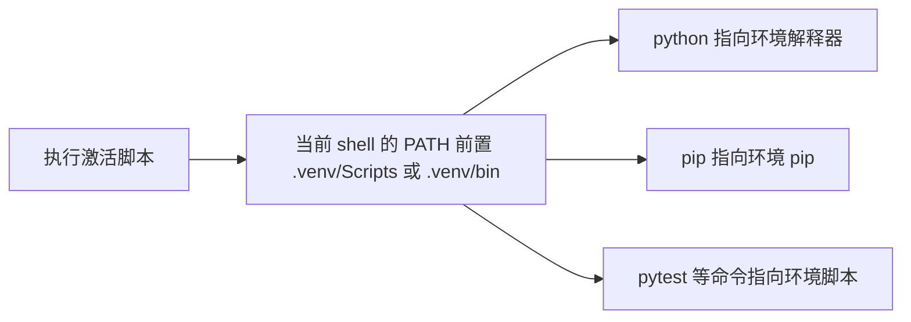

+++
date = '2026-10-05T23:35:00+08:00'
draft = false
title = 'Python 虚拟环境完全指南：venv、激活、解释器与依赖隔离'
+++
“我明明已经安装了这个包，为什么 `import` 还是失败？”

这句话大多数时候不是 Python 不讲道理，而是安装包的解释器和运行代码的解释器不是同一个。系统 Python、IDE 选中的 Python、终端里的 `python`、项目的 `.venv`，只要其中任意两个不一致，就足以制造相当稳定的困惑。

Python 虚拟环境解决的不是“让包能安装”这么简单的问题，而是让**一个项目拥有自己的解释器入口、自己的包安装位置和可重建的依赖边界**。本文以标准库 `venv` 为主，解释它实际创建了什么、激活到底改变了什么、何时根本不必激活，以及它如何与 `requirements`、lock 文件、IDE、CI、Docker 协作。

## 一、虚拟环境究竟隔离了什么

先看一个典型冲突：项目 A 需要 Django 4，项目 B 需要 Django 5。如果都向同一个全局 Python 安装包，后安装的版本很可能覆盖或改变先前项目的运行条件。

```text
没有虚拟环境

系统 Python
  ├── Django 4  ← 项目 A 希望使用
  └── Django 5  ← 项目 B 安装后改变了环境

有虚拟环境

项目 A/.venv  ── Django 4
项目 B/.venv  ── Django 5
系统 Python   ── 保持为基础解释器
```

`venv` 创建的是一个轻量级目录，其中包含一套针对该项目的 Python 入口、`pip` 与 `site-packages` 安装位置。默认情况下，它不会暴露基础 Python 已安装的第三方包；项目只能看到自己环境中明确安装的依赖。Python 官方文档将虚拟环境定义为基于一个 base Python 创建、默认与基础环境包隔离的环境。[Python `venv` 文档](https://docs.python.org/3/library/venv.html)

需要准确一点：虚拟环境**不是容器**，也不会复制操作系统、显卡驱动、C 编译器或系统动态库。它主要隔离 Python 解释器入口和 Python 包安装位置。若项目依赖 CUDA、FFmpeg、PostgreSQL、浏览器或系统 DLL，这些外部依赖仍要分别管理。

## 二、`venv` 创建后目录里有什么

在项目根目录执行：

```bash
python -m venv .venv
```

通常会得到如下结构：

```text
my-project/
├── .venv/
│   ├── pyvenv.cfg
│   ├── Scripts/                  # Windows
│   │   ├── python.exe
│   │   ├── pip.exe
│   │   └── Activate.ps1
│   └── Lib/site-packages/        # Windows
├── src/
└── requirements.txt
```

在 Linux、macOS 等 POSIX 系统中，对应目录通常是：

```text
my-project/
└── .venv/
    ├── pyvenv.cfg
    ├── bin/
    │   ├── python
    │   ├── pip
    │   └── activate
    └── lib/python3.x/site-packages/
```

`pyvenv.cfg` 会记录创建该环境的基础 Python；`Scripts` 或 `bin` 目录放置环境专用的解释器、pip 与激活脚本。官方文档也明确说明，Windows 使用 `Scripts`，POSIX 使用 `bin`，第三方包则安装到该环境自己的 `site-packages` 下。[Python `venv` 的创建结构](https://docs.python.org/3/library/venv.html)

这解释了一个重要结论：`.venv` 是**可丢弃的构建产物**，不是项目源代码的一部分。不要把它提交到 Git，不要把业务代码放进去，也不要把复制整个 `.venv` 当成部署方案。

## 三、创建环境：先选对 Python，再谈依赖

创建环境的命令使用的是“当前执行 `-m venv` 的 Python”。因此，多 Python 版本环境中最重要的不是记住命令，而是确认**是哪一个解释器在创建环境**。

### 1. Windows：优先显式选择版本

Windows 有多个 Python 时，可以先查看 Python Launcher 识别到的解释器：

```powershell
py -0p
```

再用指定版本创建环境：

```powershell
py -3.12 -m venv .venv
```

随后确认它确实是预期版本：

```powershell
.\.venv\Scripts\python.exe --version
```

不要在不确定 `python` 指向哪里的情况下直接执行 `python -m venv .venv`。它当然会忠实地创建环境，只是可能忠实地使用了你并不想用的 Python 3.10、商店版 Python，或另一个工具链安装的解释器。

### 2. Linux / macOS：用目标解释器创建

```bash
python3.12 -m venv .venv
.venv/bin/python --version
```

如果系统只提供 `python3`，先确认版本：

```bash
python3 --version
```

在项目声明 Python 3.12、lock 针对 Python 3.12 时，用 Python 3.10 创建环境再安装，通常不是“差一点也能凑合”的问题，而是从一开始就不满足项目边界。

### 3. `--system-site-packages` 为什么通常不该用

`venv` 默认隔离基础环境的包。加上 `--system-site-packages` 后，环境能看到系统 Python 的第三方包：

```bash
python -m venv .venv --system-site-packages
```

这有时适合受限机器上的临时实验，但会削弱隔离性：你可能在项目中无意使用了全局包，换到 CI 或同事机器后便无法复现。日常项目、课程作业、服务和桌面应用都应优先使用默认隔离模式。

## 四、激活到底做了什么

激活并不是“开启虚拟环境的开关”。它本质上只是修改当前 shell 的环境变量，最重要的是把 `.venv` 的脚本目录放到 `PATH` 前面，于是你输入 `python`、`pip`、`pytest` 时，会优先命中虚拟环境中的可执行文件。



### 1. 各 shell 的激活命令

Windows PowerShell：

```powershell
.\.venv\Scripts\Activate.ps1
```

Windows `cmd.exe`：

```bat
.venv\Scripts\activate.bat
```

Linux / macOS 的 bash、zsh：

```bash
source .venv/bin/activate
```

激活成功后，命令行提示符一般会出现 `(.venv)`。这只是一个视觉提示，不是可靠的诊断依据；真正应检查的是解释器路径。

```powershell
python -c "import sys; print(sys.executable)"
python -m pip --version
```

```bash
python -c 'import sys; print(sys.executable)'
python -m pip --version
```

两条命令输出的路径应落在 `.venv` 内。

### 2. 不激活也完全可以使用虚拟环境

这是许多人最晚才意识到的一点：**激活是方便，不是必需。**可以始终显式调用虚拟环境解释器。

Windows：

```powershell
.\.venv\Scripts\python.exe -m pip install -r requirements.txt
.\.venv\Scripts\python.exe -m pytest
.\.venv\Scripts\python.exe main.py
```

Linux / macOS：

```bash
.venv/bin/python -m pip install -r requirements.txt
.venv/bin/python -m pytest
.venv/bin/python main.py
```

CI、Makefile、PowerShell 脚本和部署脚本尤其应偏好这种写法，因为它不依赖“前一步刚好激活过环境”的隐含状态。Python 官方文档同样指出，不必激活环境；直接使用环境中的 Python 路径即可。[venv 激活与非激活使用方式](https://docs.python.org/3/library/venv.html)

### 3. 为什么推荐 `python -m pip`，而不是裸 `pip`

即使已经激活，也建议写：

```bash
python -m pip install requests
```

而不是只写：

```bash
pip install requests
```

前者明确要求“当前 `python` 所属环境运行 pip”，解释器与安装器绑定得更紧。若 `PATH` 配置混乱，裸 `pip` 有可能来自另一个环境；`python -m pip` 至少让你能从 `python` 的来源开始排查。

## 五、如何确认当前真的在虚拟环境中

不要只看提示符。下面的 Python 代码是最可靠的自检：

```python
import sys

print(f"executable: {sys.executable}")
print(f"prefix: {sys.prefix}")
print(f"base_prefix: {sys.base_prefix}")
print(f"in_venv: {sys.prefix != sys.base_prefix}")
```

当解释器来自 `venv` 时，`sys.prefix` 指向 `.venv`，而 `sys.base_prefix` 指向创建它的基础 Python；二者不同即可判断当前解释器处于虚拟环境中。[Python 官方的判断方式](https://docs.python.org/3/library/venv.html)

排查 `ModuleNotFoundError` 时，按下面顺序执行通常比反复重装包有效：

```bash
python -c "import sys; print(sys.executable)"
python -m pip --version
python -m pip show <包名>
python -c "import <包名>; print(<包名>.__file__)"
```

四个输出应指向同一个环境。若 `pip show` 找得到包、`import` 却失败，首先怀疑运行程序的 `python` 不是安装时的那个。

## 六、虚拟环境与 requirements / lock 文件如何分工

虚拟环境保存的是“此刻安装在哪里”；requirements 和 lock 保存的是“应当安装什么”。它们互补，不能互相替代。

```text
.venv/
  当前机器的、可删除的已安装环境

requirements/base.in
  人维护的直接依赖与版本策略

requirements/base.lock
  工具生成的完整依赖版本与哈希
```

一个标准流程是：

```bash
# 1. 创建项目环境
python -m venv .venv

# 2. 用该环境的解释器安装经锁定的依赖
.venv/bin/python -m pip install --require-hashes -r requirements/base.lock

# 3. 运行项目或测试
.venv/bin/python -m pytest
```

Windows 只需将 `.venv/bin/python` 换为 `.venv\Scripts\python.exe`。

依赖文件中还可能出现：

```text
# requirements.txt
-r requirements/base.lock
```

它表示 `requirements.txt` 是一个包含外部 requirements file 的入口，而不是说 `.venv` 自己会读取 lock。关于 `requirements.txt`、`-r`、`.in`、`-c` 和哈希 lock 的完整解释，请阅读 [Python 依赖管理与锁文件：从 requirements 到 CPU 和 CUDA Profile](Python 依赖管理与锁文件：从 requirements 到 CPU 和 CUDA Profile.md)。

## 七、虚拟环境可以删除，但不应该移动或复制

虚拟环境目录里的脚本通常记录环境解释器的绝对路径。例如 Linux 的控制台脚本会包含类似：

```text
#!/absolute/path/to/project/.venv/bin/python
```

因此，把项目从 `D:\work\demo` 移到另一个路径、复制 `.venv` 给同事，或者把 Windows 环境压缩后解压到 Linux，都可能让脚本失效。官方建议将虚拟环境视为不可移动、可重建的产物，而不是需要迁移的资产。[Python `venv` 的可移植性说明](https://docs.python.org/3/library/venv.html)

正确做法是删除并重建：

```powershell
# Windows PowerShell：确认没有 Python/IDE 正在占用环境后执行
Remove-Item -LiteralPath .venv -Recurse -Force
py -3.12 -m venv .venv
.\.venv\Scripts\python.exe -m pip install -r requirements.txt
```

```bash
rm -rf .venv
python3.12 -m venv .venv
.venv/bin/python -m pip install -r requirements.txt
```

删除命令只应对确认无误的项目级 `.venv` 执行。它应当是可恢复的，因为依赖声明和 lock 已保存在版本控制中；如果环境删掉后无法重建，问题不在于删错了目录，而在于项目从未把依赖交代清楚。

## 八、IDE、Jupyter、CI 与 Docker 的边界

### 1. IDE 必须选中项目解释器

在 VS Code、PyCharm 等 IDE 中，终端激活 `.venv` 并不会自动保证运行按钮、测试发现器和 Jupyter 内核都使用同一解释器。应在项目设置中选择：

```text
Windows: <项目>\.venv\Scripts\python.exe
Linux/macOS: <项目>/.venv/bin/python
```

修改 IDE 解释器后，再用 `sys.executable` 打印一次路径。尤其在全局 Python、Conda、WSL 和项目 `.venv` 并存时，猜测通常没有价值。

### 2. Jupyter kernel 也有自己的解释器选择

Notebook 页面能 import 某个包，并不证明终端或项目脚本也能 import。Jupyter kernel 可能绑定在另一个环境。应在目标 `.venv` 中安装和注册 kernel，再在 Notebook 中切换到对应 kernel；不要把“浏览器里暂时能跑”当作环境配置正确的证据。

### 3. CI 不需要激活

CI 中常见的可靠写法是：

```bash
python -m venv .venv
.venv/bin/python -m pip install --require-hashes -r requirements/base.lock
.venv/bin/python -m pytest
```

显式路径让每一步依赖关系清楚，也避免 CI shell 是否继承激活状态这一类偶然因素。

### 4. Docker 通常不需要项目 `.venv`

容器本身已经提供进程和文件系统隔离。许多 Docker 镜像直接把依赖安装到镜像中的系统 Python，而不再创建 `.venv`。这不是否定虚拟环境，而是避免在已经隔离的容器里重复一层隔离。关键仍是使用 lock、固定基础镜像与运行测试，不能因为在 Docker 里就重新允许依赖随意漂移。

## 九、`venv`、Conda 与 uv 应怎样选择

| 工具 | 更适合什么 | 不解决什么 |
| --- | --- | --- |
| `venv` | 标准 Python 项目、学习基础、轻量依赖隔离 | 不解析 lock、不管理系统级库。 |
| Conda | 科学计算、复杂原生库、需要 Conda 包渠道的环境 | 不自动让项目依赖可复现，仍需明确环境定义。 |
| uv | 新项目、依赖解析、lock、快速同步和 Python 版本管理 | 不会改变虚拟环境隔离这一基本概念。 |

对于大多数普通 Python 项目，先掌握 `venv + python -m pip + lock 文件` 已足够。`uv` 可以进一步把创建环境、解析依赖和同步环境做得更自动化，但它管理的仍然是虚拟环境；理解底层边界不会因为工具更快而失去必要性。

## 十、常见问题

### 1. PowerShell 禁止执行 `Activate.ps1`

可以只对当前用户调整执行策略：

```powershell
Set-ExecutionPolicy -ExecutionPolicy RemoteSigned -Scope CurrentUser
```

或者完全不激活，直接使用 `.\.venv\Scripts\python.exe`。后者往往更适合脚本和 CI。Python 官方文档也将 PowerShell 执行策略列为 Windows 激活脚本可能需要处理的前置条件。[Windows PowerShell 激活说明](https://docs.python.org/3/library/venv.html)

### 2. 升级 Python 后旧 `.venv` 还能继续用吗

有时可以使用 `venv --upgrade`，但对项目而言更稳妥的方案通常是新建环境、按 lock 重新安装并跑测试。特别是 Python 小版本变化、包含 C 扩展、PyTorch、NumPy、OpenCV 等二进制包时，重建往往比修补旧环境更容易证明正确。

### 3. 为什么 `.venv` 已在 `.gitignore`，还要有 requirements/lock

`.gitignore` 只决定哪些文件不提交；它不会记录依赖。`.venv` 应忽略，是因为它是机器相关、可重建的产物；requirements 和 lock 应提交，是因为它们是重建环境的说明书。

### 4. 激活后 `pip install` 还是装错地方怎么办

不要继续猜。执行：

```bash
python -c "import sys; print(sys.executable)"
python -m pip --version
```

若路径不在同一个 `.venv`，改用该环境 Python 的绝对/相对路径执行 `-m pip`。如果路径一致而安装失败，再去看包名、版本、索引、网络和系统依赖；排查顺序错了，只会让终端输出越来越多，答案却越来越远。

## 十一、日常项目清单

- 每个项目使用自己的 `.venv`，并将其加入 `.gitignore`；
- 创建环境前确认 Python 版本；
- 优先使用 `python -m pip`，而不是裸 `pip`；
- 用 `sys.executable`、`sys.prefix` 和 `python -m pip --version` 排查环境错位；
- 把 `.venv` 视为可删除、可重建的产物，不复制、不迁移；
- 将 requirements / lock 提交到 Git，用它们重建环境；
- CI 中使用环境 Python 的显式路径，不依赖激活状态；
- Python、平台或关键二进制依赖变更后，新建环境并重新测试。

虚拟环境最重要的价值并不是多出一个 `.venv` 目录，而是让“运行的是哪个 Python、包安装到了哪里、别人怎样重建同一个环境”都有明确答案。能把这三件事说清楚，依赖问题就不再是玄学；它只是路径、解释器和声明是否一致而已。
